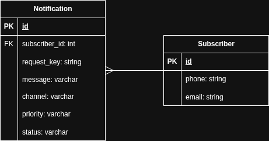
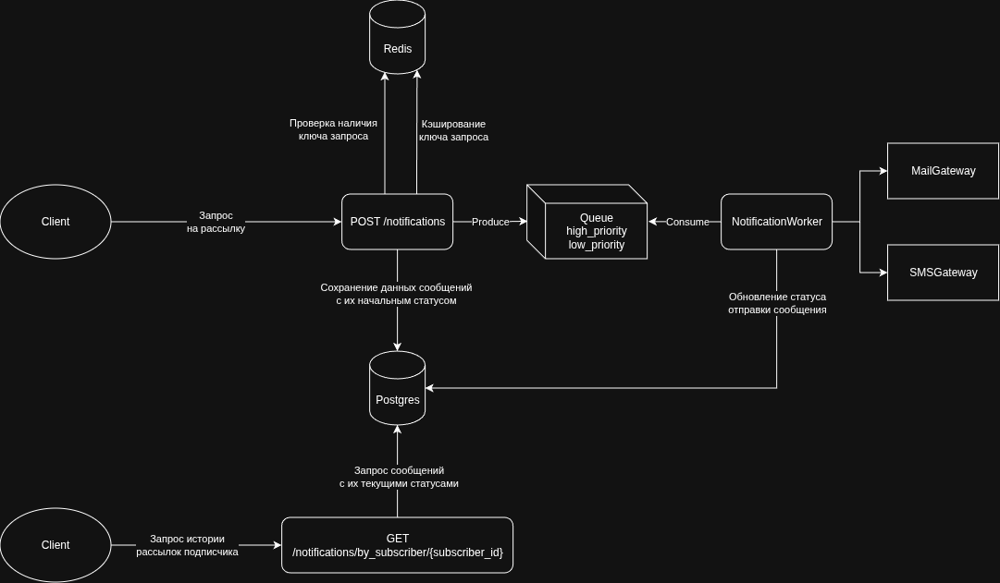

# Сервис рассылки уведомлений

Проект решения тестового задания на реализацию микросервиса уведомлений.

Шаги запуска проекта в docker:

1. В корне проекта скопируйте пример файла с настройками окружения .env.example в .env
2. Поднимите докер контейнеры
3. Создайте структуру данных в БД

```shell
cp .env.example .env
docker-compose up -d
docker exec -it notification_app php artisan migrate
```

Документация API будет доступна в Swagger по адресу:  
<http://localhost:2080/api/documentation>

## Информационная модель



## Схема взаимодействия компонентов системы


